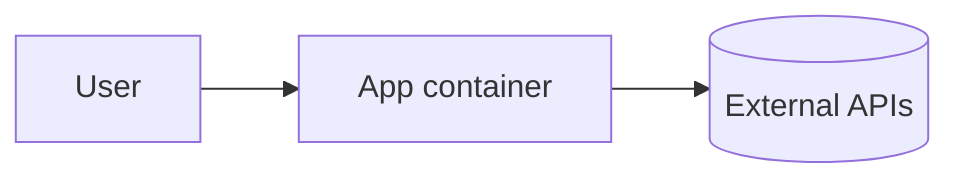

# Architecture

> Update whenever the system's shape changes. CI flags infra changes without an update here or in RUNBOOK.

## Overview
TODO: one paragraph.

## Components
| Component | Purpose | Runs where |
|---|---|---|
| app | TODO | local / AWS |

## Data
TODO: what's stored, where, retention, backups.

## Secrets
Names only (never values): TODO. Stored in AWS Secrets Manager; loaded at runtime.

## Environments
- dev: local Docker
- prod: TODO
