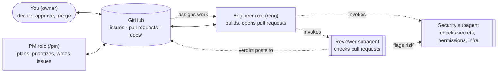

# semilla

**A self-improving template for starting software projects with Claude Code, opinionated toward AWS.**

Every project grows from it, and each one sends what it learned back, so the next one starts smarter.

[:material-source-repository: Use this template](https://github.com/manoochehri/semilla/generate){ .md-button .md-button--primary }
[:material-book-open-page-variant: Read the playbook](playbook.md){ .md-button }

---

## The problem

semilla is built specifically for **Claude Code** — not a generic, tool-agnostic agent framework — and it's opinionated about where projects run: **AWS is the default, recommended deploy target.** Fly.io, GCP, and local-only remain fully supported options for when AWS isn't the right fit; semilla just doesn't stay neutral about the primary path.

Working with Claude Code on a real project runs into the same problems again and again:

- **Agents forget.** Sessions end, contexts reset, and plans or decisions kept only in chat are lost.
- **Copy-paste glue.** Moving notes between an "advisor" chat and a coding agent by hand loses information.
- **Secrets leak easily.** Keys end up in `.env` files, logs, commits, or chat.
- **No project management.** No charter, no milestones, no record of *why* something was decided.
- **Results look better than they are.** Agents grade work against their own assumptions instead of reality.
- **Safety limits drift.** An agent "helpfully" loosens a threshold nobody approved.

semilla's answer: **the repo is the memory; Claude Code sessions are disposable.** Everything durable — goals, plans, design, decisions, status, results — lives in the repo as plain markdown. Any fresh session reads it and picks up where the last one stopped.

## How it works

A small team, talking to each other through GitHub — never through chat memory that can vanish with a closed window.



The PM writes issues, the engineer turns issues into pull requests, and you approve and merge. Only `/pm` and `/eng` switch the session's role directly in Claude Code; the reviewer and security checks are subagents the engineer calls on — automatically as part of `/work` and `/check-pr`, or ad hoc ("have security check this"). Everything is visible, and nothing depends on a chat surviving. See [the team](team.md) for the full roster, and the [playbook](playbook.md) for how a normal day actually runs.

## A normal day

```
you + PM (/pm)  →  issues  →  engineer (/eng)  →  pull request  →  reviewer subagent + CI  →  you merge
```

Ten to fifteen minutes of your attention: a morning briefing, a decision or two, a merge or two, and a one-line "wrap up" at the end. The [playbook](playbook.md) walks through the whole loop and has an FAQ for everything in between.

## Quick start

1. **Create a repo from this template:**
   ```bash
   gh repo create my-project --private --template manoochehri/semilla --clone
   cd my-project && make setup
   ```
   Or click **Use this template** above.
2. **Open it in Claude Code** and run `/kickoff`. It interviews you (idea, success criteria, budget, deadline, constraints, stop rule, where it runs), shows you the charter and plan, and sets everything up. AWS is the recommended deploy target; Fly.io, GCP, and local-only are also available (see [`infra/`](https://github.com/manoochehri/semilla/tree/main/infra)).
3. **Start working:** `/start` reads the docs and proposes what to do next; approve it and it opens a pull request when done.

See the [guide](guide.md) for the full setup walkthrough, including the optional GitHub Actions automation.
